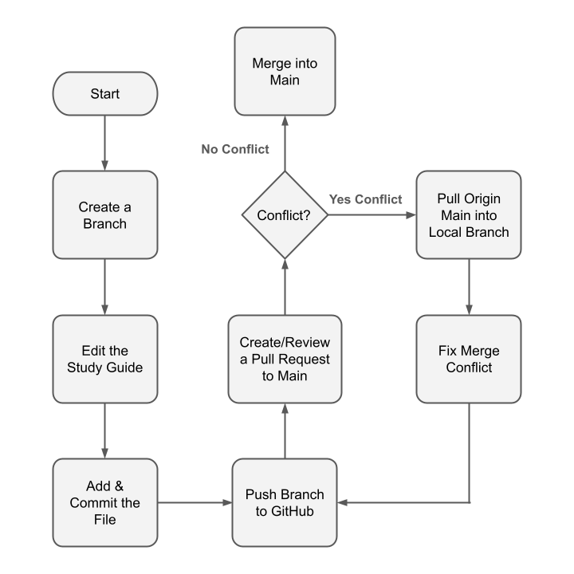

# Merge Mayhem

## Overview

CodePath students are coming together to create a super study guide. Student submissions have all been organized and a final study guide is ready for their study session tomorrow when a nasty virus comes in and corrupts the file. Can you help your fellow students put all the pieces back together?

In this activity, you will be working with your group members to put together multiple pieces of a single student submission using Git. You will successively merge in content from each person’s copy of their submission repo. Once all the merges are complete and all merge conflicts are resolved, you’ll have a complete study guide you can submit to the original repo with a pull request.

## Learning Goals

The goal of this activity is to give you exposure to the process of resolving merge conflicts. Because merge conflicts are a natural part of any collaborative development effort, this is an important skill to have as a developer.

With this activity, you will be able to encounter and resolve merge conflicts in a controlled scenario where the correct resolution of all merge conflicts is clear.

## Instructions

### Baseline Setup

Before we can start putting the study guide together, we need to make sure that everyone in your group is working from the same starting point and can effectively contribute to the study guide building effort.

<!--Update group names -->
1. **Split into groups**:
   - Group 1: CSS Basics
   - Curassow
   - Gecko
   - Sloth
   - Lionfish
   - Pangolin
   - Rhino
   - Tarsier

2. **Fork the activity repo**: One person in your group should fork the [study-guide-repo](./public-repo-link) <!--Insert public repo--> repo and then add everyone else as a collaborator.
    - To add collaborators, go to **Settings** --> **Manage access** --> **Invite teams or people**
    - Invited collaborators will need to accept the invitation.
3. **Clone the forked repo**: Everyone in your group should clone the forked repository.
    - Check that you have the proper remote (and not the CodePath remote) by typing `git remote -v` in the terminal.

4. **Find your study guide scrap**: Each group is assigned six(6) or seven(7) study guide scraps, located in the `/scraps` directory, that should all be part of the same study guide. You can split these scraps up amongst your group however you wish.

### Building the Study Guide

Once everyone in your group has completed the baseline setup instructions above, you're ready to start building the study guide together.

1. **Create your branch**: Each person on a team will create a branch for themselves. Use `git switch -c BRANCH-NAME` to create the branch. Replace `BRANCH-NAME` with a name based off the study guide scrap you have.
2. **Add your study guide scrap**: Copy the contents of your study guide scrap into the study guide file and then add and commit your changes to the study guide file. After completing this step, each person in your group should have **different** content within the study guide file in their local repository.
3. Each team member will push their changes up to GitHub with `git push origin BRANCH-NAME`.
4. Each team member will open a **pull request** trying to merge their branch on GitHub into `main`.  **Be very careful to make the PR against your forked repository and NOT CodePath.**
    - To make the PR against your team members' forked repository and not CodePath, we will need to change the base repository.
    - If there is a report of a merge conflict, you will need to:
       - Pull the current state of main into **their feature branch** with `git pull origin main`
       - In VS Code, select **accept both changes**
       - Resolve the merge conflicts by rearranging the study guide and commit the result
       - Push the result up to GitHub with `git push origin BRANCH-NAME`
       - Then attempt to merge their pull request. If new changes have happened on main, they may have to repeat step 1 above.
5. Merge changes simultaneously, kind of like the _ad-hoc_ strategy.
    - **Remember**: Whoever on your team is merging their changes into main must successfully finish that process (including fixing any merge conflicts!) before the next person can begin.  Help them with resolving the conflicts.
    - Work with your fellow team members to resolve any merge conflicts.
6. Once everyone's changes have been merged together, the group as a whole should review it for completeness.
    - Make sure that none of the lines from your individual scrap are missing from the final result.
    - If there are any fixes needed, pick one person in the group to make the necessary changes and commit them.
7. When everyone agrees that the study guide looks correct, _one_ person should submit a PR to the original study-guide-repo.
8. Finally, debrief with your whole group about how things went.
    - What went well? What didn't?
    - Were there any merge conflicts that were particularly tricky to figure out?
    - How could this process have been made easier?
    - Write up a set of steps to follow when dealing with merge conflicts.

### Activity Workflow

## General advice

There are a few things to look out for when working through this activity:

- The end result should be a real, usable study guide. The original study guide files were all complete works from various educational resources online.
- If you find that the result of one of your merges is missing critical information or any numbered steps, you should go back and double-check that you didn't lose any lines while resolving a merge conflict.
- Your study guide scraps may have duplicate lines. We've added these in to more accurately portray the full range of potential merge conflicts. **Important**: you should get rid of any duplicate lines while merging.
- There's no "right" way to do this activity, all of the strategies listed below are valid ways to build the study guide.
- Have fun!

## Collaboration strategies

There are a number of ways that a group of developers can collaborate to handle merging their changes together into a final, correct result. Each strategy has pros and cons. For example, if a particular strategy is good for minimizing the number of complex merge conflicts, it probably requires a slower development process in which developers are often waiting on their peers to merge in changes before they can start working.

There are several ways for teams to collaborate on a project and handle merging changes into a single `main` branch on GitHub.

- **Round robin**: This strategy involves direct coordination between everyone in the group, resulting in a strictly ordered merge sequence.
  - One at a time, each person pushes their changes and resolves any merge conflicts.
  - The next person in turn pulls those changes and pushes their own until everyone's changes have been pushed.
- **Ad-hoc**: This approach relies the most upon Git's merge coordination capabilities to ensure that everyone's changes get merged in properly.
  - Essentially, everyone attempts to `git push` at once.
  - The first person to get there doesn't have to merge, but everyone after that probably will.
- **Branched**: This approach is kind of a mix of the other two.
  - It uses a more advanced feature of Git known as _branching_.
  - Branching is generally considered the heart of a Git-based workflow and you'll have an opportunity to try it on a larger team project. This is what we're trying today!

## Resources

- [Git Cheat Sheet](https://education.github.com/git-cheat-sheet-education.pdf)
